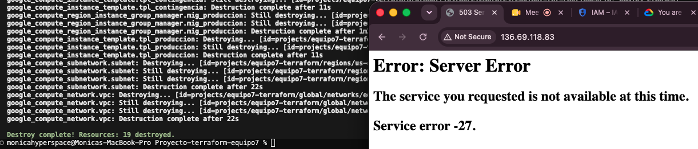

# Proyecto Terraform — Servicios en la Nube 2026-01 — Grupo 7

Infraestructura como código (IaC) en **Google Cloud Platform** que despliega un
**balanceador de carga HTTP global** con una única IP pública, capaz de repartir
el tráfico entre un **Servicio Principal (Producción)** y un **Servicio de
Contingencia (Mantenimiento)** modificando **únicamente** un archivo de variables.

- **Proyecto GCP:** `equipo7-terraform`
- **Región / Zona:** `us-central1` / `us-central1-a`
- **Integrantes:** Mónica Sierra, Mario Cañas, María Fernanda Calle

---

## Arquitectura

Un solo `terraform apply` levanta toda la arquitectura:

- **Red (VPC):** VPC custom `equipo7-vpc` + subred `equipo7-subnet` (`10.0.0.0/24`).
- **Firewall:** permite health checks del balanceador (rangos `130.211.0.0/22`
  y `35.191.0.0/16`) al puerto 80; bloquea SSH (puerto 22) desde internet.
- **Cómputo:** dos grupos de instancias administrados (MIG) **regionales e
  independientes** (`e2-micro`, Debian 12), uno por servicio. Cada VM sirve su
  página HTML por el puerto 80. Cumplen el aislamiento de fallos: producción y
  contingencia nunca comparten máquina.
- **Balanceo:** balanceador HTTP global `EXTERNAL_MANAGED` con reparto de tráfico
  ponderado (`weighted_backend_services`) controlado por variables.
- **Punto de entrada único:** una sola IP pública global (`equipo7-lb-ip`).

```
Internet ──► IP pública global ──► HTTP Proxy ──► URL Map (pesos)
                                                     │
                                   ┌─────────────────┴─────────────────┐
                                   ▼                                   ▼
                         Backend Producción                 Backend Contingencia
                                   │                                   │
                            MIG Producción                     MIG Contingencia
                            (e2-micro, :80)                    (e2-micro, :80)
```

---

## Requisitos previos

- Terraform >= 1.5.0
- Cuenta de GCP con acceso al proyecto `equipo7-terraform`
- `gcloud` autenticado:
  ```bash
  gcloud auth login
  gcloud auth application-default login
  gcloud config set project equipo7-terraform
  ```

---

## Cómo desplegar

```bash
# 1. Crear tu archivo de variables a partir del ejemplo
cp terraform.tfvars.example terraform.tfvars

# 2. Inicializar y desplegar
terraform init
terraform plan
terraform apply
```

La IP pública del balanceador se obtiene con:

```bash
terraform output lb_ip_address
```

> Nota: la IP se asigna dinámicamente en cada despliegue. Usa el valor que
> devuelva `terraform output` en tu entorno para hacer las pruebas.

---

## Escenarios de evaluación

El comportamiento del tráfico se controla **solo** con dos variables en
`terraform.tfvars` (escala GCP 0–1000). Tras cambiarlas, ejecutar
`terraform apply` de nuevo y esperar 1–2 minutos a que el balanceador propague.

| Escenario | `weight_produccion` | `weight_contingencia` | Resultado esperado |
|-----------|---------------------|-----------------------|--------------------|
| 1 — Producción activa | `1000` | `0` | 100 % de las visitas ven el Servicio Principal |
| 2 — Mantenimiento total | `0` | `1000` | 100 % de las visitas ven la Página de Error 503 |
| 3 — Balance equitativo | `500` | `500` | Las visitas alternan entre ambos servicios |

Mensajes exactos que sirve cada servicio:
- **Producción:** `Bienvenido al Servicio Principal - Versión Producción`
- **Contingencia:** `Error 503 - Sitio en Mantenimiento Programado`

### Cómo probar cada escenario

En el navegador: abrir `http://<IP_DEL_BALANCEADOR>/` y recargar varias veces.

En terminal (útil sobre todo para el escenario 50/50, muestra la mezcla):

```bash
for i in $(seq 1 10); do curl -s http://<IP_DEL_BALANCEADOR>/ | grep -o '<h1>.*</h1>'; done
```

---

## Evidencias

### Escenario 1 — Producción activa (1000 / 0)


---

### Escenario 2 — Mantenimiento total (0 / 1000)


---

### Escenario 3 — Balance equitativo (500 / 500)


---

### Cierre del proyecto — `terraform destroy`



---

### (Opcional) IAM — Acceso del profesor


---

## Acceso e IAM (revisión)

El acceso del profesor está definido como código en `iam.tf` y se crea con el
`apply`. Miembros con rol `roles/editor`:

- `vdrestrepot@unal.edu.co` (profesor — revisión)
- `morestrepol@unal.edu.co` (Mónica)
- `mcalleag@unal.edu.co` (María Fernanda)
- `mcanas@unal.edu.co` (Mario)

El `project_id` está parametrizado como variable, por lo que el repositorio se
ejecuta en el proyecto sin modificar los archivos `.tf`.

---

## Estructura del repositorio

| Archivo | Responsable | Contenido |
|---------|-------------|-----------|
| `provider.tf` | Moni | Provider y versiones |
| `variables.tf` | Moni | Variables del equipo (incluye pesos de tráfico) |
| `network.tf` | Moni | VPC y subred |
| `firewall.tf` | Moni | Reglas de firewall |
| `ip.tf` | Moni | IP pública global |
| `compute.tf` | Mario | Instance templates, MIGs, health checks |
| `loadbalancer.tf` | Mafe | Backends, URL map con pesos, proxy, forwarding rule |
| `iam.tf` | Todos | IAM (profesor + equipo) |
| `outputs.tf` | Todos | Salidas del despliegue |
| `terraform.tfvars.example` | — | Plantilla de variables con los 3 escenarios |
| `CONVENCIONES.txt` | — | Contrato de integración del equipo |

---

## Limpieza

```bash
terraform destroy
```

Esto elimina toda la infraestructura creada por el proyecto. No borra el
proyecto de GCP ni revoca IAM; solo destruye los recursos de Terraform.
